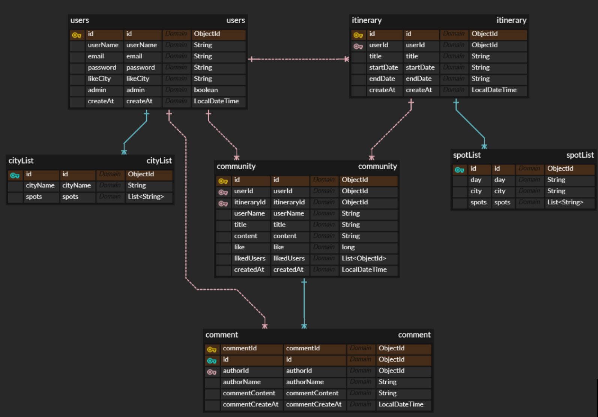

## team2-BackendProject

일본 여행 정보 제공, 일정 관리 웹사이트 입니다.

## 🖥 웹사이트 페이지 소개

## 📚 기술 스택
- **BackEnd**: Java Servlet, MongoDB  
- **FrontEnd**: JSP, Bootstrap, JavaScript

## 🗂 ERD (Entity Relationship Diagram)

> 본 프로젝트는 **MongoDB(NoSQL)** 를 사용하지만,  
> 데이터 구조와 관계를 보다 쉽게 이해하기 위해 **ERD를 참고용으로 작성**하였습니다.

## 🌐 크롤링 및 외부 API 사용

- **맛집 정보 (크롤링)**: https://tabelog.com/kr/
- **관광지 정보 (크롤링)**: https://japantravel.navitime.com/ko/
- **날씨 정보 (크롤링)**: https://tenki.jp/lite/
- **지도 서비스 (API)**: Google Maps API

## 📦 사용 라이브러리 / 패키지

- **Jsoup**: 1.12.2  
- **MongoDB Driver**
  - bson: 5.6.0
  - mongodb-driver-core: 5.6.0
  - mongodb-driver-sync: 5.6.0
- **JSTL**
  - jakarta.servlet.jsp.jstl: 3.0.1
  - jakarta.servlet.jsp.jstl-api: 3.1.0-M1
- **JSON**
  - json: 20250517

## 🎥 시연 영상 (YouTube)

👉 https://www.youtube.com/watch?v=ygMWu4Q1iEA

## 👨‍💻 개발자
- 김희식 (조장, 백엔드 및 개발 전반, cka8701@gmail.com)
- 길재현 (팀원, 프론트 및 디자인, kil07201@naver.com)
- 조영재 (팀원, 프론트 및 백엔드, youngjae0243@naver.com)
